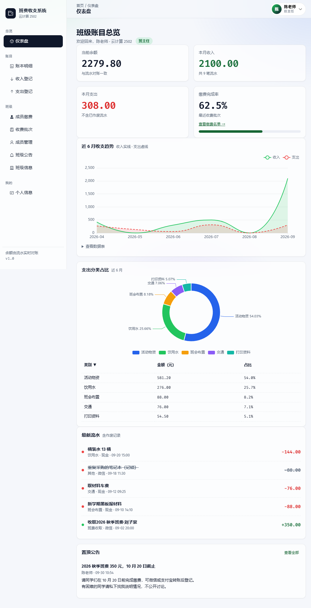
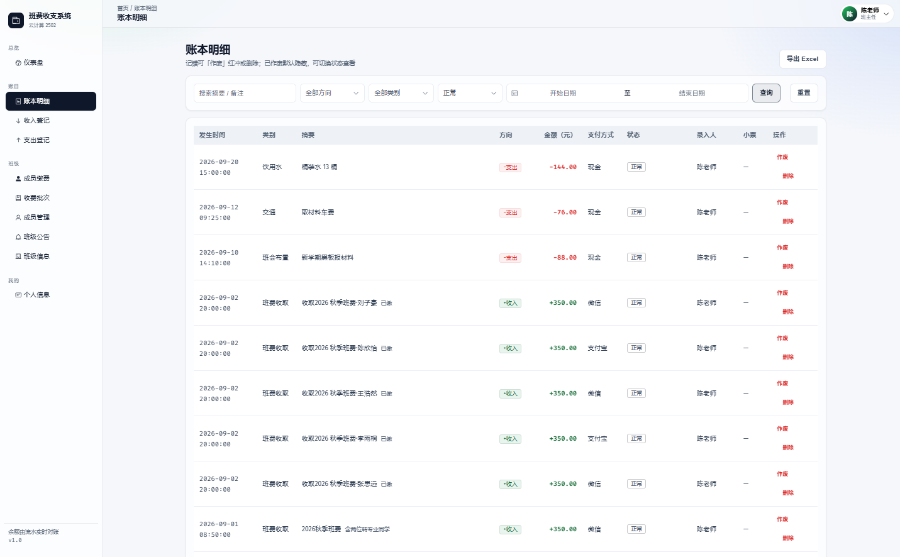
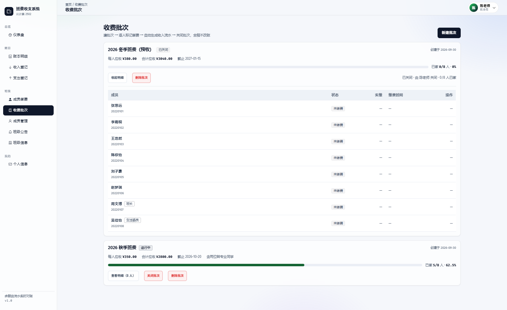
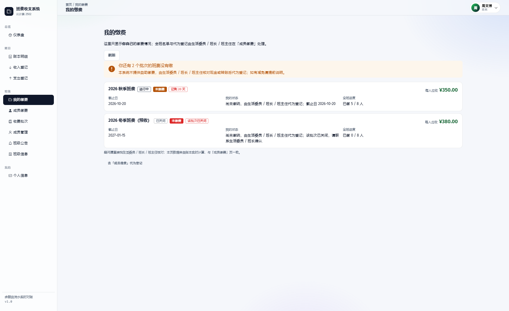
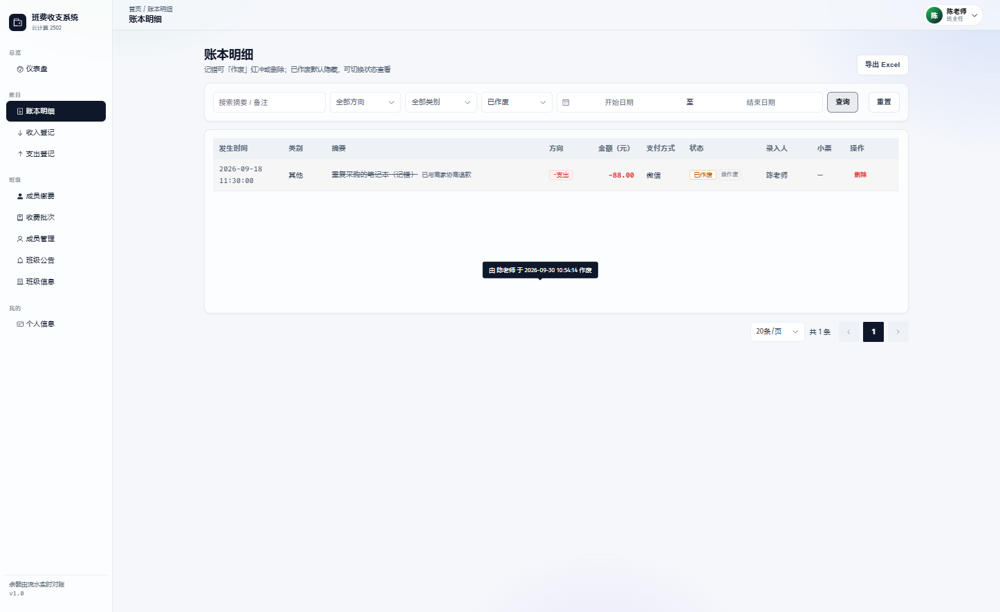
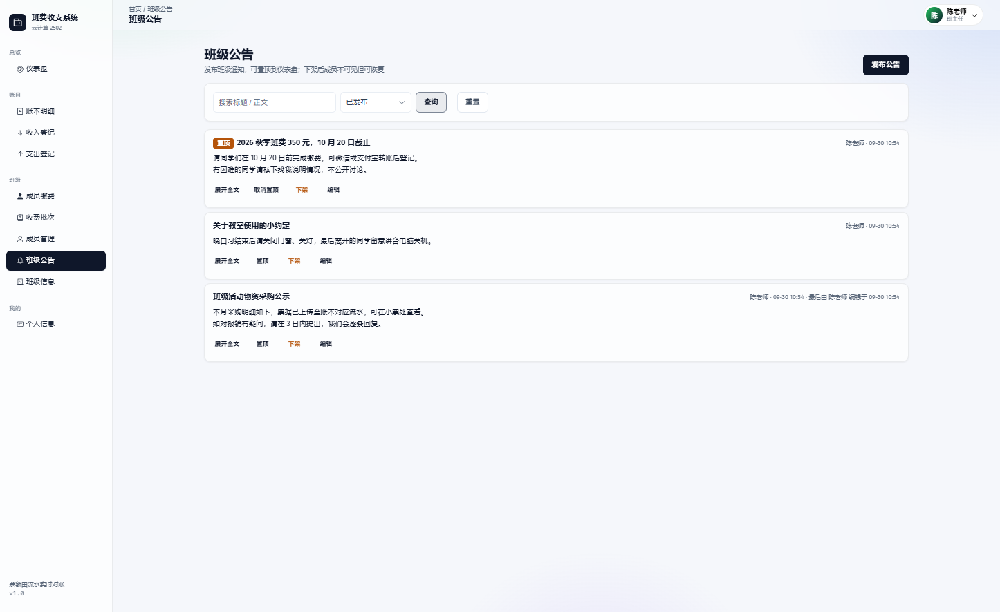

<div align="center">

# 班费收支系统 · ClassFee Manager

**一个班级的班费账本：公开、透明、可追溯、好对账。**

记账有据（每笔可挂小票） · 缴费有序（批次逐人标记） · 错账可追（作废留痕而非抹除）

[](LICENSE)
[](server-py/)
[](web/)
[](server-py/)
[](server-py/tests/api_regression.py)

`Vue 3 + Element Plus` ｜ `FastAPI + SQLAlchemy 2.0` ｜ `MySQL 8 / MariaDB`

</div>

---

## ⚠️ 这是一个 Vibe Coding 项目

---

## 界面一览

### 仪表盘 · 余额实时对账、近 6 月趋势、支出分类占比



### 账本明细 · 多条件筛选、方向用 +/− 标注（不只靠颜色）



### 收费批次 · 逐人标记缴费、自动生成流水、关闭留痕



### 我的缴费 · 同学能看到自己交没交、还剩几天截止



### 审计留痕 · 已作废流水的「谁作废、什么时候」



### 班级公告 · 置顶、下架可恢复、最后编辑人留痕



> 以上截图取自**演示数据**（`test` 账号 + 8 名虚拟同学）。真实部署时数据库是空的，由班主任自行建号与记账。

---

## 这是什么

一个**给单个班级用**的班费管理系统。班主任（/ 班长 / 生活委员）负责记账和收钱，同学们能看账本、能看自己交没交。

**没有注册页，只有登录页。** 账号由部署方声明或由运营在页面创建，代码里不写死任何默认口令。

适合的场景：一个 30–60 人的大学班级或一个初中班级，需要一笔笔把班费记清楚、期末能对得上账。
不适合的场景：多学校/多租户的 SaaS、需要审批流的财务系统。

---

## 功能

| 模块 | 说明 | 谁能用 |
|------|------|--------|
| 登录 / 会话 | 账号密码登录，JWT（HS256 / 2h），改密码 | 全部 |
| 仪表盘 | 余额、本月收支、缴费完成率、近 6 月趋势、支出分类占比、最新流水、置顶公告 | 全部 |
| 收入登记 | 班费 / 义卖 / 捐款 / 退款 | 运营 |
| 支出登记 | 报销 / 采购，**可挂小票图片** | 运营 |
| 账本明细 | 多条件筛选、分页、**按当前筛选导出 Excel**、作废红冲、删除 | 运营看全部；成员只读 |
| 我的缴费 | 我有没有班费要交 / 交没交 / 什么时候截止 | 成员（运营角色不参与缴费） |
| 成员缴费 | 缴费名单、按人补录缴费、缴清筛选 | 运营 |
| 收费批次 | 建批次 → 逐人标记缴费 → 自动生成流水 → 关闭 / 删除 | 运营 |
| 班级公告 | 发布 / 编辑 / 置顶 / 下架（可恢复）/ 彻底删除 | 运营写，全员读 |
| 成员管理 | 建号（四档角色）、编辑资料与学号、重置密码、停用启用、删除 | 运营 |
| 班级信息 | 班级名称 / 年级 / 班主任（余额只读） | 运营写，全员读 |
| 个人中心 | 改密码、改姓名 / 学号 / 手机号 | 全部 |

### 角色与权限

| 界面名 | 标识 | 等级 | 权限 | 缴费对象 |
|--------|------|------|------|---------|
| 普通成员 | `MEMBER` | 0 | 只读 | ✅ 交班费 |
| 生活委员 | `ADMIN` | 1 | 运营 | ✅ 交班费 |
| 班长 | `MONITOR` | 2 | 运营 | ✅ 交班费 |
| 班主任 | `TEACHER` | 3 | 运营 | ❌ 不参与 |

- **运营权限三者一致**（记账 / 作废 / 小票 / 成员管理 / 批次 / 公告），差别在两处：
  - **账号管理有等级护栏**——不能创建或操作比自己等级高的账号（`班主任 > 班长 > 生活委员 > 普通成员`）
  - **缴费对象不同**——缴费名单只列**除班主任外的全部学生**，因为班主任是部署时声明的**老师账号、不是学生**（见 [设计文档 §1](docs/系统设计文档.md)）
- **权限由后端强制**：`_STAFF_ROUTES` 角色路由表 + 端点级 `require_role`，共 **22** 条受限路由。
  前端路由守卫只负责隐藏入口，**不构成安全边界**。
- **归属权（A 方案）**：改 / 删 / 作废 / 关闭只能操作**自己创建**的数据。代价是班主任也动不了班长的数据——
  这是为了责任可追溯而接受的取舍，报错信息会带上创建人。
- 班级信息里的「班主任」是 `cls_class.head_teacher` 独立字段（填姓名），与角色无关。

---

## 快速开始

需要 **Python 3.13+**、**Node 22+**、一个 MySQL 8 / MariaDB 库。

```bash
# 1. 建库（账号 / 库名按需改）
mysql -uroot -p -e "CREATE DATABASE classfee DEFAULT CHARSET utf8mb4;"

# 2. 后端 :8080 —— 建表与种子数据由启动时幂等执行，无需手动导 SQL
cd server-py
python -m venv .venv
.venv/bin/pip install -r requirements.txt          # Windows：.venv\Scripts\pip
.venv/bin/python -m uvicorn app.main:app --host 127.0.0.1 --port 8080

# 3. 前端 :5173（/api 已代理到 :8080）
cd web && npm install && npm run dev
```

打开 <http://localhost:5173>，用**部署时声明的账号**登录（见下方「账号体系」，代码里没有默认口令）。

> Windows 下也可以直接双击 `start-all.bat`（同时拉起前后端），
> 或分别用 `start-backend.bat` / `start-frontend.bat`。

**首次启动日志里会看到这几类提示，都不是故障**：

| 日志 | 含义 |
|------|------|
| `未配置 CLASSFEE_TEACHER_USERNAME / PASSWORD` | 没声明账号。库里若已有运营账号可忽略，否则见「账号体系」 |
| `已升级 sys_user.role 枚举：新增 'MONITOR'` | 一次性枚举升级，第二次启动不再出现 |
| `已补审计列：…` | 一次性 DDL 迁移，第二次启动不再出现 |
| `已把 N 条缴费行补进进行中的批次` | 缴费对象口径升级后的一次性回填，第二次启动不再出现 |
| `db/schema.sql 带 UTF-8 BOM` | **别忽略**——按下方「编码规则」存为无 BOM |

---

## 账号体系

**没有注册页，只有登录页。** 账号不写死在代码里，也**没有默认口令**。

| 来源 | 账号 | 密码 | 角色 |
|------|------|------|------|
| **部署配置声明** | `CLASSFEE_TEACHER_USERNAME` | `CLASSFEE_TEACHER_PASSWORD` | 班主任（默认）/ 生活委员 |
| 运营在页面创建 | 「成员管理 → 新增成员」时指定 | 运营设定 | 四档任选 |

```bash
cp .env.example .env        # 编辑；docker compose 会自动读取仓库根目录的 .env
```

```bash
# 手动部署时等价的环境变量
CLASSFEE_TEACHER_USERNAME=test              # 必填（与 PASSWORD 同时）
CLASSFEE_TEACHER_PASSWORD=换成强口令          # 必填
CLASSFEE_TEACHER_NAME=测试班主任              # 可选，默认同用户名
CLASSFEE_TEACHER_ROLE=TEACHER                # 可选，ADMIN | TEACHER
CLASSFEE_JWT_SECRET=<openssl rand -hex 32>   # 令牌签名密钥，生产必填
```

- **仅首次创建**：账号已存在则跳过，**不覆盖**库里改过的密码 / 角色 / 停用状态。
- **半配置不建号**：用户名与密码必须同时填写；两项都为空则不创建任何账号。
- **可管理**：改资料 / 学号、重置密码、停用（保历史、禁登录）、删除（**仅限零引用**账号——有流水 / 缴费 / 公告 / 批次记录一律拒绝并引导改用停用）。
- **停用即时生效**：中间件每次请求都查 `sys_user.status`，被停用的账号**已签发的 JWT 立即失效**。
- **学号**：与登录名分开填，同班不可重复，留空默认取登录名。

---

## 部署到服务器

看 **[`docs/部署-Linux.md`](docs/部署-Linux.md)**：手动部署（systemd + nginx 反代）或 **Docker Compose 一键部署**（§9，不用装 Python / Node / nginx）。

服务器上已有 MySQL/MariaDB 时用 `docker-compose.use-existing-db.yml`（复用现有库、不另起容器），见部署文档 §9.6。

```bash
docker compose -f docker-compose.use-existing-db.yml up -d --build
```

---

## 设计要点

- **单一事实**：收支共用一张 `fee_record` 流水表。**记错优先走「作废（红冲）」留痕**，运营也可物理删除（事务内回滚余额并联动缴费状态）；列表默认隐藏已作废。
- **审计留痕**：作废 / 关闭 / 编辑都会记下**谁**在**什么时候**动的（`voided_by`、`closed_by`、`updated_by`）。
  界面可见「由 X 于 … 作废」「最后由 X 编辑于 …」。
  *删除仍是硬删、无痕——所以留痕路径是「作废 / 下架」，界面文案一律引导「记错优先作废」。*
- **余额**：`SUM(收入 NORMAL) − SUM(支出 NORMAL)` 实时对账，`cls_class.balance` 作冗余列在**同一事务内原子 UPDATE**，不接受手改。
- **金额**：数据库 `DECIMAL(10,2)`，Python 侧 `Decimal` + `HALF_UP` 量化，**全链路禁止 float**。
- **缴费单一入口**：成员缴费与流水在「收费批次 → 标记缴费」一个事务里写入（`fee_record` + `fee_payment.status` + 余额），杜绝第二条资金写入路径。
- **小票**：支出可挂票据图片（`POST /api/files` 上传 → `receiptUrl` 挂账 → 账本点「查看」带 token 取图），服务端魔数嗅探 + uuid 命名 + ≤5MB；仅支出可挂，删流水时回收文件。
- **公告**：读全员、写运营；「下架」是软删（成员不可见、运营可恢复），「彻底删除」要求先下架，防误删无从找回。
- **UI**：浅色玻璃拟态；**绿色 = 收入、红色 = 支出，但必须同时带 +/− 符号**，不靠颜色单独传达信息。
- **无障碍**：正文对比度 ≥4.5:1，弹层三条关闭路径（Esc / × / 遮罩），`prefers-reduced-motion` 降级，图表带 `role="img"` 与动态 `aria-label`，侧栏用原生 `<a>`（可 Tab 可达、中键新开标签页）。

### 数据模型

7 张表，`schema.sql` 由后端启动时**幂等执行**（`CREATE TABLE IF NOT EXISTS`）。

| 表 | 用途 |
|----|------|
| `cls_class` | 班级（含冗余余额列） |
| `sys_user` | 用户，四档角色 ENUM |
| `fee_category` | 收支类别字典（软删：`status=0`） |
| `fee_record` | **核心流水**，作废 = 红冲，审计列 `voided_by/voided_at` |
| `fee_batch` | 收费批次，审计列 `closed_by/closed_at` |
| `fee_payment` | 逐人缴费状态 |
| `sys_notice` | 班级公告，审计列 `updated_by/updated_at` |

> 改列定义必须同时写**幂等 `ALTER` 迁移**（`seed.py` 里已有 3 个：角色枚举、审计列、缴费名单回填）——
> `CREATE TABLE IF NOT EXISTS` 不会变更既有库。

---

## 参与开发

```bash
# 后端热重载
cd server-py && .venv/bin/python -m uvicorn app.main:app --reload --host 127.0.0.1 --port 8080

# 前端类型检查 + 构建
cd web && npm run type-check && npm run build

# 契约回归（**需后端在运行**，零依赖）
.venv/bin/python server-py/tests/api_regression.py
```

**回归是本项目唯一常驻的自动化闸门**——`test_*` 命名可被 pytest 直接收集，也可当脚本跑。当前 **288 项断言全绿**，覆盖：流水与作废红冲、缴费批次与级联、类别软删、账号与四档角色等级、归属权、审计留痕、缴费对象口径、停用后 JWT 即时失效、跨班隔离、金额不变量、**文件编码闸门**。

### ⚠️ 编码规则：谁读这个文件，决定它有没有 BOM

| 读者 | 编码 | 范围 |
|------|------|------|
| **程序**（nginx / MySQL / shell / Docker / 任何按字节或按行解析的解析器） | **UTF-8 无 BOM** | `*.conf`、`*.sh`、`Dockerfile*`、compose yml、`*.sql`、`*.json`、`*.toml`/`*.ini`/`*.cfg`、`*.bat`、`*.ps1`、`.env*`、CI 配置 |
| **人**（编辑器 / GBK 工具 / Notepad） | **UTF-8 带 BOM** | `docs/*.md`、`README.md`、`*.txt` |
| 人机都不敏感 | 无所谓 | 全部 `.py`（Python 自动识别源文件 BOM） |

**中文注释在「无 BOM」那一侧完全安全**——`nginx.docker.conf` 与 `schema.sql` 里的中文注释从来没出过问题，**坏的只有 BOM 本身**。

踩过的坑：带 BOM 的 `nginx.docker.conf` 会让 nginx 报 `unknown directive " server"`、**frontend 容器起不来**；
带 BOM 的 `schema.sql` 会让首行注释不被剔掉 → 第一条建表语句被 `except: continue` **静默吞掉** → **新库少一张表且启动日志零告警**。

**保存为 UTF-8 无 BOM，不要用 Windows 记事本编辑**（它默认写 GBK，部分版本还会对已有文件追加 BOM）。
VS Code 右下角能直接看到是 `UTF-8` 还是 `UTF-8 with BOM`。以上规则由回归的第一个用例
`test_a00_encoding_guards` 自动检查（会扫描全仓库并逐个指名带 BOM 的文件）。

### 数据库迁移

改列定义时**必须**同步两处，缺一不可：

1. `server-py/db/schema.sql`（新库靠它建表）
2. `server-py/app/seed.py` 里的幂等 `ALTER`（既有库靠它升级）

漏了第 2 步，已有的库不会变更；给 ENUM 加值还会直接 500（`DataError 1265`）。

---

## 目录结构

```
classfee-manager/
├─ server-py/              后端（FastAPI，:8080）
│  ├─ app/
│  │  ├─ services/         业务规则与事务（record / batch / user / file / notice / class / export / dashboard / category / auth）
│  │  ├─ routers/          HTTP 层，只做参数校验与响应包装
│  │  └─ main / config / db / models / security / schemas / responses / errors / helpers / seed
│  ├─ db/schema.sql        7 张表 DDL（启动时幂等执行）
│  ├─ tests/               契约回归（api_regression.py，零依赖，288 项）
│  └─ requirements.txt
├─ web/                    前端（Vue 3 + Vite，:5173）
│  └─ src/                 api / views / components / stores / router / types / utils / styles
├─ docs/
│  ├─ 系统设计文档.md        权威设计文档：权限矩阵、DDL、全部接口、22 轮交付记录（含踩坑）
│  └─ 部署-Linux.md         手动部署 / Docker Compose / 故障排查
├─ design-system/          UI 设计规范（含交付前检查清单）
├─ prototype/              可点击的高保真原型
├─ server/                 （存档）早期 Java 实现，仅供 REST 契约对照，不参与运行
├─ docker-compose.yml               一键部署（自带数据库容器）
├─ docker-compose.use-existing-db.yml  复用服务器上已有的 MySQL/MariaDB
├─ start-*.bat             Windows 一键启动
└─ .env.example            部署变量模板（复制为 .env 填写）
```

**技术规模**：后端 34 个 Python 文件 / 约 4,500 行；前端 37 个文件 / 约 8,900 行；36 个 REST 端点；11 个页面。

---

## 文档索引

| 文档 | 内容 | 适合谁 |
|------|------|--------|
| [`docs/screenshots/`](docs/screenshots/) | README 与文档用界面截图（演示数据） | 想先看效果 |
| [`docs/系统设计文档.md`](docs/系统设计文档.md) | **权威设计文档**：角色权限矩阵、模块清单、7 张表 DDL、全部 REST 接口与错误码、目录结构、安全方案、**22 轮交付记录（含踩坑与教训）** | 改代码前必读 |
| [`docs/部署-Linux.md`](docs/部署-Linux.md) | Linux 手动部署、Docker Compose、复用已有数据库、生产注意事项、故障排查、备份更新 | 部署运维 |
| [`design-system/classfee-manager/MASTER.md`](design-system/classfee-manager/MASTER.md) | **UI 规范**：色彩 token、字号、间距、组件规格、响应式断点、动效、**交付前检查清单** | 改界面样式 |
| [`prototype/dashboard.html`](prototype/dashboard.html) | 高保真原型（仪表盘 + 记一笔弹窗），可双击直接打开 | 想先看效果 |
| [`server-py/tests/api_regression.py`](server-py/tests/api_regression.py) | **288 项契约回归**断言（Python，零依赖），改后端必跑 | 改接口 |

---

## 运维要点

| 项 | 说明 |
|----|------|
| **契约回归** | 改后端后跑 `server-py/tests/api_regression.py`（**需后端在运行**），288 项断言 |
| **JWT 密钥** | `CLASSFEE_JWT_SECRET` 生产必须注入随机串；**改它会让所有已登录会话立即失效** |
| **数据库备份** | `mysqldump -u classfee -p classfee > backup_$(date +%F).sql`，建议 cron 每日执行 |
| **小票文件** | 落在磁盘（默认 `server-py/uploads/`，`CLASSFEE_UPLOAD_DIR` 可改），**不在数据库里**，备份要连目录一起备；nginx 需放开 `client_max_body_size 6m`（默认 1m 会让 5MB 小票 413） |
| **Docker 卷** | compose 已挂 named volume `classfee_uploads` 持久化小票 |
| **时区** | 应用内固定 `Asia/Shanghai`（systemd / compose 均已设 `TZ`），服务器系统时区不必改 |
| **升级** | 替换源码后 `docker compose -f docker-compose.use-existing-db.yml up -d --build`；**只重启不生效**（配置是 `COPY` 进镜像的） |

### 已知限制

- **硬删无痕**：`DELETE /records/{id}`、`/batches/{id}`、`/notices/{id}` 是物理删除，**留不下任何痕迹**。
  这是物理事实而非疏漏——留痕路径是「作废 / 下架」，界面文案一律引导「记错优先作废」。
- **多班级未实现**：`class_id` 字段已就位，但没有多班级切换与跨班汇总。
- **金额无业务上限**：仅有 `DECIMAL(10,2)` 的存储约束（约 9999 万），未做业务层封顶。
- **Docker 镜像未在开发机实测**（开发机无 Docker），`Dockerfile` 与 compose 只做过静态校对与 BOM 检查。
- **`server/` 是存档**：早期 Java 实现，不参与运行，保留仅为 REST 契约对照。

---

## License

[MIT](LICENSE) © 2026 ClassFee Manager contributors
